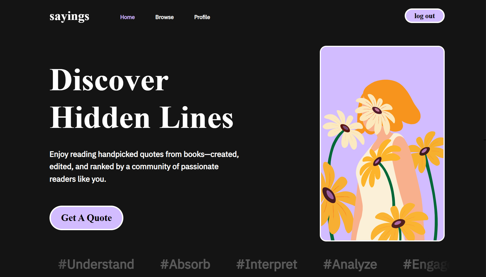

# Sayings

**Sayings** is a full-stack social web application for sharing, voting on, and discovering meaningful quotes through community signals and personalized feeds.  
Built as the CS50x final project, it focuses on clean system design, API architecture, and data-driven ranking rather than complex ML.

---

## Core Features

- Global feed of quotes available instantly to all users
- Community contributions (users can post their own quotes)
- Upvote / downvote model to surface high-quality content
- Personalized feed based on user interactions and preferences
- Secure user accounts with authentication and permissions
- Responsive UI with real-time vote updates

---

## Tech Stack

### Backend
- Django
- Django REST Framework
- PostgreSQL

### Frontend
- React
- Tailwind CSS

---

## Architecture Highlights

- Designed a **normalized PostgreSQL schema** for quotes, votes, authors, categories, and user activity
- Built **RESTful APIs** for authentication, voting, feed retrieval, and personalization
- Implemented **vote integrity logic** and permission handling with Django REST Framework
- Developed an **engagement-based ranking algorithm** using vote signals and user activity (no ML)
- Clean separation between frontend and backend through API communication
- Component-based React architecture for feed rendering, auth flows, and interactions

---

## Personalization Logic

Instead of machine learning, Sayings uses lightweight signal-based ranking:

- Tracks user interactions (votes, categories, sources)
- Weighs engagement patterns
- Ranks and surfaces quotes aligned with user interests in real time

This keeps the system efficient, explainable, and fast.

---

## What This Project Demonstrates

- Database schema design for social systems
- API design and permission systems
- Authentication flows and secure backend architecture
- Ranking and personalization logic
- Full frontend–backend integration
- Building a complete production-style web application

---
## Screenshots

### Landing Page

---

## Links

- Live App: https://sayings-quotes.vercel.app/home  
- Source Code: https://github.com/Abdelrhman1326/sayings  

---

Sayings explores how simple interaction signals and thoughtful data modeling can create a meaningful social experience without relying on complex machine learning.
